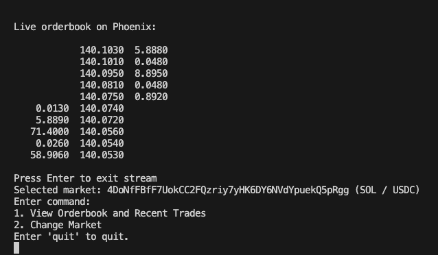

### A Terminal UI for Phoenix DEX

[Phoenix](https://www.phoenix.trade/) is one of the largest DEX's on Solana. This repo provides functionality to:
- View the orderbook for a particular Phoenix market
- View the recent trade list

### Design choices 

The program interfaces with Solana via a websocket connection initialised on startup. From there, when the user requests to view a token pair, it subscribes to `accountSubscribe` changes on the account representing the token pair on Phoenix, and `logsSubscribe` to get transactions. It then polls a RPC http endpoint to get the full transaction.

To deserialise the on-chain data the program has a dependency on `phoenix-sdk`. Similarly, to print the orderbook it uses the `phoenix-v1` crate.